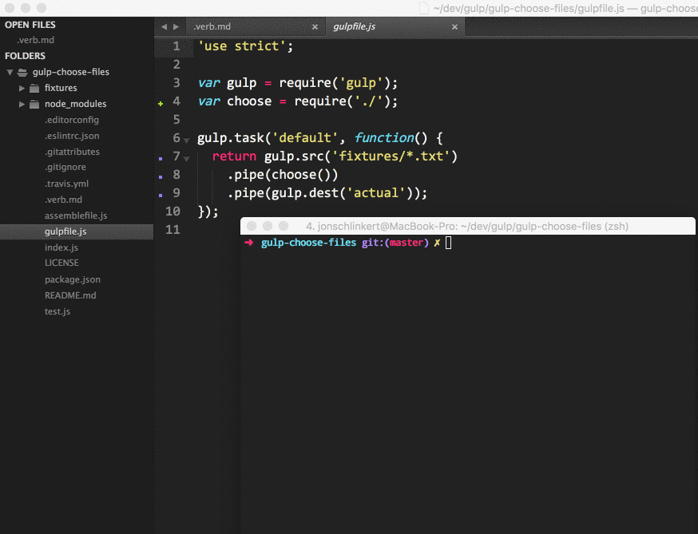

## Usage

```js
var gulp = require('gulp');
var choose = require('');

gulp.task('default', function() {
  return gulp.src('fixtures/*.*')
    .pipe(choose())
    .pipe(gulp.dest('actual'));
});
```

## options.key

**Type**: `string`

**Default**: `relative`

Specify the [vinyl][] `file` property to use when displaying file names in the choices array.

**Examples**

Given the file path `/dev/fixtures/foo.txt` (depending on cwd and `file.base`), here is what you would get:

```js
choose({key: 'path'});
//=> '/dev/fixtures/foo.txt'
choose({key: 'relative'});
//=> 'fixtures/foo.txt'
choose({key: 'basename'});
//=> 'foo.txt'
choose({key: 'stem'});
//=> 'foo'
```

## options.choices

If you need to be able to automatically skip the prompt, you can pass a string or array with your "choices" to `options.choices`.

The following will only write `a.txt`:

```js
gulp.task('default', function() {
  return gulp.src('fixtures/*.txt')
    .pipe(choose({choices: ['a.txt']}))
    .pipe(gulp.dest('actual'));
});
```
